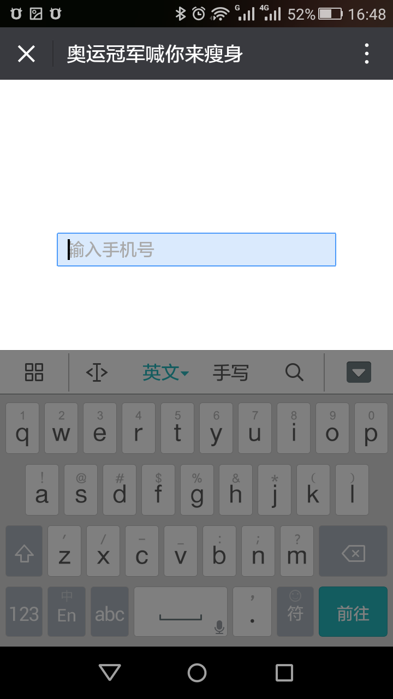

## 壹点壹客项目

### 简介

项目主要通过调用微信录音接口，录取用户的唱歌内容，上传到后台并与原唱进行比较，返回评分信息。

#### 微信录音

关于微信录音，在第一次录音的时候会弹框请求用户的录音授权，所以建议在刚进入页面的时候，先预请求一次录音授权，以免影响后续流程。

录音时长不能过短也也不能过长，否则可能会导致localId无法获取。

微信录音完成后，通过localId请求微信接口，会返回serverId，通过serverId可以获取存储在微信服务器上的录音内容。

---

## 好享瘦直播项目

### 预览


还有些页面以及抽奖方面的逻辑没有截图出来。

### 工时

10月11日开始技术踩点，12日正式开始开发，预计16日交付。

16日晚交付，甲方提出需求更改。延期两天交付。

18日晚交付，甲方再次提出需求更改，延期一天交付。

19日正式交付项目。

### 预览地址(建议微信下打开)

http://gm16380362914.g.syhaohaowan.com/web/game/game_id/1638036291

### 简介

页面载入后，会播放一系列动画，之后跳转到视频播放页面，在视频播放页面需要实现视频内的交互，比如送花，弹幕等等。视频播放完毕会进行抽奖。

### 难点

#### 视频内交互

如果纯video标签，不加属性，打开视频会自动跳转到使用手机内的视频播放器播放视频，相当于全屏播放视频。在这种情况下是无法实现边播放视频边实现交互的。

后来想到的两个解决方案。1、使用canvas实现视频播放器。2、研究是否可以不使用手机自带播放器播放视频。

最后使用了第2套解决方案,canvas转码播放视频存在性能方面的问题。之后发现可以通过`playinline`属性让视频内嵌播放，基于这个属性解决了视频内交互的问题。

#### 横竖屏问题

这个项目前4个页面是横屏的，后4个页面是竖屏的。理想状况下应该做到无论用户是横屏看手机还是竖屏看手机，都应该是正常的样式，该横着显示就横着显示。后来由于时间关系，没办法做到这么完美，所以采用了假横屏的方案。

假横屏的解释是指，手机此刻是竖着放的，但是页面是横着布局的，所以页面看起来是横屏的，如果用户没有锁屏，直接旋转成为横屏，样式会错乱，所以需要用户锁定竖屏下才能旋转手机体验。

假横屏的布局可以`rotate`标签实现快速布局。设定以下属性

```
// 旋转页面
.t-rotate{
    transform-origin: 0px 0px 0px;
    transform: rotate(90deg) translate3d(0,-100vw,0);
}

/**
 * 修改横竖屏模式
 * 正式在手机上测试时 需要手机锁定竖屏 然后切换到build模式
 * 在电脑上调试时 把电脑上的手机横屏显示 然后切换到dev模式 便可以调试样式
 */
 @mixin changeMode($type){
    @if $type == dev {
        width:100vw;
        height: 100vh;
        position: absolute;
        top: 0;
        left: 0;
    }@else if $type == build{
        @extend .t-rotate;
        width: 100vh;
        height: 100vw;
        position: absolute;
        top: 0;
        left: 0;
    }
}
```

在开发环境下可以正常的横屏布局，之后需要发布的时候可以把内容`rotate`过来，就不必在竖屏模式下把页面内容横过来布局了，十分方便。

#### 动画实现

前面的介绍动画是通过AE导出，然后结合`bodymovin`这个库实现的。优点是节省开发时间，让设计在AE里面调试动画，但是缺点也很明显，过大的动画在安卓上可能会卡顿。

#### BUG

##### 安卓下input标签白屏问题

在安卓下，如果input标签写的太低，等到输入的时候，如果弹出的键盘挡住了input标签，结果会把input标签顶上来，导致BUG出现，影响有可能是部分白屏。



解决办法：

可以把input标签的布局往上移，尽量高于页面50%，这样键盘基本无法挡住。

如果实在是要把input标签写在底部，那么我们可以监听`focus`事件和`blur`事件。当标签`focus`时候，输入框上移，`blur`时候输入框恢复原来位置，这样可以一定程度内修复这个问题。

##### 苹果安卓无法自动播放视频和音频

苹果跟安卓更新后，无法自动播放视频音频，需要用户进行一定的交互才能执行播放，比如需要用户点击某个按钮等。

如果确实想自动播放音视频，可以通过借助微信的`WeixinJSBridgeReady`事件实现

```
document.addEventListener("WeixinJSBridgeReady", function () {
    audio.play();
}, false);
```

需要注意的是，`WeixinJSBridgeReady`需要绑定到页面初始化事件里面。

现假设这样的情况，一共2个页面，1是loading页面，在此执行初始化，2是我们需要自动播放音乐的页面。我们想让音乐自动播放，把`WeixinJSBridgeReady`绑定到2页面会发现行不通，因为跳转到2时，早已经初始化了，我们必须把`WeixinJSBridgeReady`绑定到1。

那么此时我们可以在1里面绑定`WeixinJSBridgeReady`事件，通过注册一个全局的Audio对象。比如

```
document.addEventListener("WeixinJSBridgeReady", function () {
    window.audio.play();
    window.audio.pause();
}, false);
```

等到检测到已经跳转到2页面时，再执行一次

```
window.audio.play();
```

这样就可以实现跳转到2页面时自动播放音频，不需要用户执行什么操作。